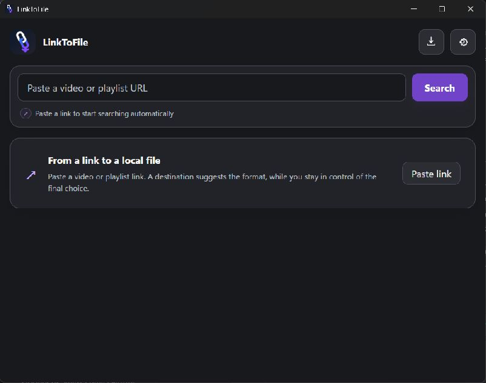
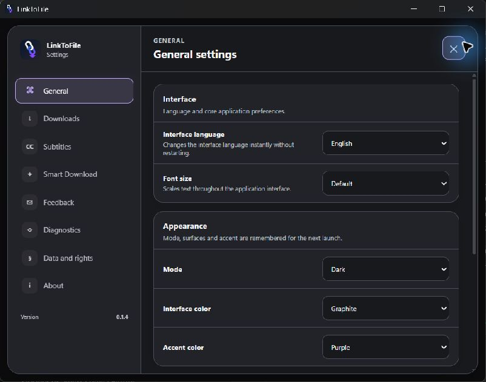
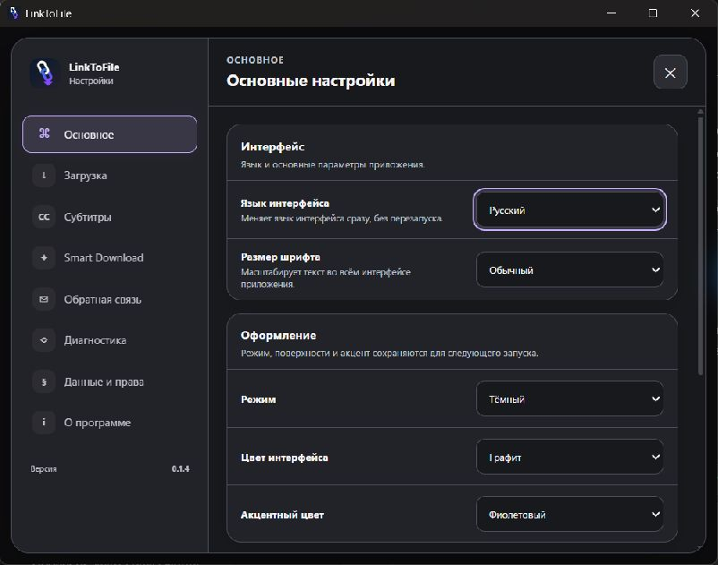

<p align="center"></p>

# LinkToFile

**Сохраните разрешённое видео по ссылке в файл на Windows.** Выберите нужное качество либо доверьте выбор Smart Download для своего устройства.

[English](README.md) · **Русский**

### [Скачать для Windows — Setup](https://github.com/NikitaCreatorDeveloper/linktofile-releases/releases/download/v0.1.3-beta/LinkToFile-0.1.3-Setup-x64.exe)

[Установщик Setup (.exe)](https://github.com/NikitaCreatorDeveloper/linktofile-releases/releases/download/v0.1.3-beta/LinkToFile-0.1.3-Setup-x64.exe) · [Portable (.zip)](https://github.com/NikitaCreatorDeveloper/linktofile-releases/releases/download/v0.1.3-beta/LinkToFile-0.1.3-windows-x64-portable.zip) · [Все релизы](https://github.com/NikitaCreatorDeveloper/linktofile-releases/releases)

**Доступная версия: 0.1.3 Beta**, опубликована 18 сентября 2026 года. Бесплатная бета с интерфейсом на русском и английском. Это ранний выпуск: сайты-источники могут меняться, поэтому отдельные ссылки могут перестать работать. Ссылки выше ведут на опубликованную версию.

## Возможности опубликованной беты

- Анализ ссылки, выбор видеоформата и качества.
- Профили Smart Download для телевизора, компьютера, телефона и архива.
- Загрузка видео с объединением аудиодорожек встроенным FFmpeg.
- Плейлисты, очередь, пауза, продолжение, отмена и повтор загрузки.
- История, открытие готовых медиафайлов и сохранение настроек.
- Интерфейс RU/EN, локальная диагностика и документы сторонних компонентов.
- Проверка подписи обновлений установленной версии; Portable обновляется вручную.

Скачивайте собственные материалы или материалы, на сохранение которых у вас есть разрешение. Соблюдайте условия сайта-источника. Публичная ссылка не даёт права на скачивание; LinkToFile не обходит DRM и платный доступ. Покупка PRO и реклама в этой бете недоступны.

## Требования и установка

Windows 10 или 11, **64-разрядная x64**, и Microsoft Edge WebView2 Runtime. Для анализа и загрузки нужен интернет. Оставьте место для готового файла и временных отдельных дорожек. Устанавливать Python, Node.js, yt-dlp и FFmpeg отдельно не требуется.

1. Скачайте **Setup** для обычной установки либо **Portable** для запуска из распакованной папки.
2. Сверьте SHA-256 файла с [SHA256SUMS.txt](https://github.com/NikitaCreatorDeveloper/linktofile-releases/releases/download/v0.1.3-beta/SHA256SUMS.txt) этого же выпуска.
3. Setup проверяет наличие WebView2 и может загрузить его установочный bootstrapper. Для Portable распакуйте **весь ZIP**, сохраните рядом папки инструментов и лицензий, затем запустите `LinkToFile.exe`. WebView2 должен быть доступен заранее.
4. Вставьте разрешённую ссылку, проверьте форматы, выберите папку и начните загрузку.

Установка на чистой Windows и работа без среды разработчика требуют отдельной приёмки; эта страница не заявляет об их независимой сертификации.

## Проверка файлов и предупреждения Windows

У опубликованных **установщика и приложения 0.1.3 нет подписи издателя Windows Authenticode**. SmartScreen может показать **Unknown Publisher / Unknown app**. Подпись обновлений Tauri проверяет пакет обновления, но не подтверждает доверенного издателя Windows и не гарантирует отсутствие предупреждений. Оставляйте защиту Windows включённой.

В PowerShell укажите путь к своему скачанному файлу:

```powershell
Get-FileHash -LiteralPath '.\LinkToFile-0.1.3-Setup-x64.exe' -Algorithm SHA256
```

Сравните результат с `SHA256SUMS.txt` **того же релиза**. Совпадение хеша подтверждает совпадение байтов с эталоном, но не доказывает безопасность файла. Перед запуском проверьте файл локальным антивирусом. Проверка всеми антивирусами не заявляется.

Установленная версия использует настроенный beta-канал с проверкой подписи обновлений. Перед обновлением завершите загрузки или поставьте их на паузу. Для Portable скачайте новый опубликованный ZIP и распакуйте его в отдельную папку; сохраните старую папку до проверки настроек и файлов.

## Preview 0.1.4 — ещё не опубликован

Это реальные скриншоты локального **preview 0.1.4** с пустым демонстрационным профилем. Они показывают разрабатываемый интерфейс; **по ссылкам выше по-прежнему доступна 0.1.3 Beta**. Дата нового выпуска не обещается.

<p></p>
<p></p>
<p></p>

## Поддержка и документы

[Сайт](https://linktofile.ru) · [Описание релиза](https://github.com/NikitaCreatorDeveloper/linktofile-releases/releases/tag/v0.1.3-beta) · [Условия беты](https://github.com/NikitaCreatorDeveloper/linktofile-releases/releases/download/v0.1.3-beta/BETA-TERMS.txt) · [Уведомления сторонних компонентов](https://github.com/NikitaCreatorDeveloper/linktofile-releases/releases/download/v0.1.3-beta/THIRD-PARTY-NOTICES.md)

Поддержка и приватные сообщения о безопасности: [nikitacreatordeveloper@gmail.com](mailto:nikitacreatordeveloper@gmail.com). Укажите версию приложения, версию Windows и короткие шаги воспроизведения. Перед отправкой диагностики удалите личные ссылки, пути, сведения об аккаунтах и секреты. Сведения об уязвимостях направляйте приватно.

Условия использования, политика конфиденциальности и лицензии на русском и английском входят в папку `licenses` и доступны в настройках приложения. Очередь, история и настройки хранятся локально; сайты-источники и серверы изображений получают сетевые запросы. Поведение буфера обмена и обновлений описано во встроенной политике конфиденциальности.

Этот публичный репозиторий содержит пользовательскую документацию и файлы распространения. Исходники LinkToFile остаются приватными. Действуют лицензия бесплатной беты и отдельные лицензии сторонних компонентов; лицензия открытого исходного кода для оригинального приложения здесь не предоставляется.
